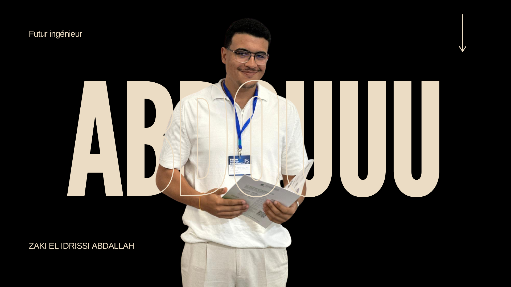

**Portfolio**
Live Preview - [Click Here](https://salesp07.github.io/)

<br/>
<div align="center">
  
</div>
<br/># 🚀 Portfolio - ZAKI EL IDRISSI ABDALLAH

<div align="center">
  
  
  [](https://reactjs.org/)
  [](https://styled-components.com/)
  [](https://mui.com/)
  [](LICENSE)
</div>

## 📋 Table des matières

- [À propos](#-à-propos)
- [Fonctionnalités](#-fonctionnalités)
- [Technologies utilisées](#-technologies-utilisées)
- [Projets présentés](#-projets-présentés)
- [Installation](#-installation)
- [Utilisation](#-utilisation)
- [Déploiement](#-déploiement)
- [Structure du projet](#-structure-du-projet)
- [Captures d'écran](#-captures-décran)
- [Contributions](#-contributions)
- [Contact](#-contact)
- [Licence](#-licence)

## 🎯 À propos

Portfolio personnel moderne et responsive de **ZAKI EL IDRISSI ABDALLAH**, développeur Full-Stack passionné par la technologie et l'innovation. Ce portfolio présente mes projets, compétences techniques et expériences professionnelles de manière élégante et interactive.

### 🌟 Points forts
- **Interface moderne** avec animations fluides
- **Support multilingue** (Français/Anglais)
- **Design responsive** adapté à tous les écrans
- **Navigation intuitive** avec scroll smooth
- **Présentation interactive** des projets

## ✨ Fonctionnalités

- 🎨 **Design moderne** avec animations et transitions
- 🌍 **Multilingue** (FR/EN) avec persistance des préférences
- 📱 **Responsive** - Optimisé pour mobile, tablette et desktop
- 🎯 **Navigation fluide** avec scroll automatique
- 📊 **Présentation des projets** avec technologies utilisées
- 🏆 **Section certifications** et stages
- 📞 **Formulaire de contact** intégré
- ⚡ **Performance optimisée** avec lazy loading
- 🎭 **Animations** avec react-animate-on-scroll
- 🎪 **Typing animation** pour l'introduction

## 🛠 Technologies utilisées

### Frontend
- **React 17.0.2** - Framework JavaScript
- **Styled Components** - CSS-in-JS pour le styling
- **Material UI** - Composants UI modernes
- **React Icons** - Icônes vectorielles
- **React Scroll** - Navigation fluide
- **React Type Animation** - Animations de texte
- **React Animate On Scroll** - Animations au scroll

### Outils de développement
- **Create React App** - Configuration de base
- **Git** - Contrôle de version
- **VS Code** - Éditeur de code
- **GitHub Pages** - Déploiement

### Langages et frameworks
- **JavaScript (ES6+)**
- **HTML5 / CSS3**
- **React Hooks**
- **Responsive Design**

## 🚀 Projets présentés

### 1. 🌱 PlantGuard — Plant Disease Detection
**Application web de détection de maladies des plantes**
- **Technologies** : React, Python, FastAPI, TensorFlow
- **Description** : Analyse et détection de maladies des plantes à partir d'images
- **Démo** : [Voir le projet](https://plant-app-elidrissi.vercel.app/)
- **Code** : [GitHub](https://github.com/Elidrissi12/plant-pfa)

### 2. 📚 Homework Management
**Plateforme de gestion des devoirs**
- **Technologies** : React, Node.js, Express, MongoDB
- **Description** : Plateforme pour enseignants et étudiants
- **Code** : [GitHub](https://github.com/Elidrissi12/devoir-backend)

### 3. 🎨 UML Class Diagram Editor
**Éditeur de diagrammes UML**
- **Technologies** : React
- **Description** : Création de diagrammes UML avec génération de code
- **Démo** : [Voir le projet](https://front-uml-zaki.vercel.app/)

### 4. 🦷 Clinident — Dental Clinic Management
**Application de gestion de clinique dentaire**
- **Technologies** : Java, JavaFX, MySQL
- **Description** : Gestion complète d'une clinique dentaire

### 5. 🏨 IMAR HOTEL
**Système de gestion hôtelière**
- **Technologies** : C#, .NET, ASP.NET Core, SQL Server
- **Description** : Application web et desktop complète

## 🚀 Installation

### Prérequis
- Node.js (version 14 ou supérieure)
- npm ou yarn
- Git

### Étapes d'installation

1. **Cloner le repository**
```bash
git clone https://github.com/Elidrissi12/portfolio-react.git
cd portfolio-react
```

2. **Installer les dépendances**
```bash
npm install
# ou
yarn install
```

3. **Lancer l'application en mode développement**
```bash
npm start
# ou
yarn start
```

4. **Ouvrir dans le navigateur**
```
http://localhost:3000
```

## 📖 Utilisation

### Commandes disponibles

```bash
# Démarrer l'application en mode développement
npm start

# Construire l'application pour la production
npm run build

# Lancer les tests
npm test

# Déployer sur GitHub Pages
npm run deploy
```

### Personnalisation

1. **Modifier les informations personnelles**
   - Éditer `src/data/ProjectData.js` pour les projets
   - Modifier `src/components/About/About.js` pour la biographie
   - Mettre à jour `src/components/Hero/Hero.js` pour l'introduction

2. **Ajouter de nouveaux projets**
   - Ajouter dans `ProjectList` dans `src/data/ProjectData.js`
   - Inclure l'image dans `public/images/`

3. **Modifier les compétences**
   - Éditer `stackList` dans `src/data/ProjectData.js`

## 🌐 Déploiement

### GitHub Pages
```bash
npm run deploy
```

### Autres plateformes
- **Netlify** : Connecter le repository GitHub
- **Vercel** : `vercel --prod`
- **Heroku** : Ajouter un `buildpack` React

## 📁 Structure du projet

```
portfolio-react/
├── public/
│   ├── images/           # Images des projets et assets
│   ├── index.html        # Template HTML
│   └── manifest.json     # PWA manifest
├── src/
│   ├── components/       # Composants React
│   │   ├── About/        # Section À propos
│   │   ├── Certification/ # Section Certifications
│   │   ├── Contact/      # Section Contact
│   │   ├── Header/       # Navigation
│   │   ├── Hero/         # Section d'accueil
│   │   ├── Projects/     # Section Projets
│   │   └── Stages/       # Section Stages
│   ├── data/
│   │   └── ProjectData.js # Données des projets
│   ├── pages/
│   │   └── Home.js       # Page principale
│   ├── App.js            # Composant racine
│   ├── App.css           # Styles globaux
│   ├── index.js          # Point d'entrée
│   └── i18n.js           # Configuration multilingue
├── package.json          # Dépendances et scripts
└── README.md            # Documentation
```

## 📸 Captures d'écran

### Page d'accueil


### Section Projets


### Section À propos


## 🤝 Contributions

Les contributions sont les bienvenues ! Pour contribuer :

1. Fork le projet
2. Créer une branche feature (`git checkout -b feature/AmazingFeature`)
3. Commit les changements (`git commit -m 'Add some AmazingFeature'`)
4. Push vers la branche (`git push origin feature/AmazingFeature`)
5. Ouvrir une Pull Request

## 📞 Contact

**ZAKI EL IDRISSI ABDALLAH**

- 📧 **Email** : [zakielidrissiabdallah@gmail.com]
- 💼 **LinkedIn** : [https://www.linkedin.com/in/abdallah-zaki-el-idrissi-23484121b/]
- 🐙 **GitHub** : [@Elidrissi12](https://github.com/Elidrissi12)
- 🌐 **Portfolio** : [https://zaki-el-idrissi-abdallah.vercel.app/]

## 📄 Licence

Ce projet est sous licence MIT. Voir le fichier [LICENSE](LICENSE) pour plus de détails.

---

<div align="center">
  <p>Fait avec ❤️ par ZAKI EL IDRISSI ABDALLAH</p>
  <p>⭐ N'hésitez pas à donner une étoile si ce projet vous a aidé !</p>
</div>
<br/>

# 🛠 Installation and Setup Instructions

1. Fork and clone this repository. You will need NodeJs and Git installed on your machine..

2. Installation: `npm install --legacy-peer-deps`

3. In the project directory, you can run: `npm start`\
Runs the app in the development mode.\
Open [http://localhost:3000](http://localhost:3000) to view it in the browser.

# Usage Instructions

1. Open the project folder and Navigate to `/src/assets/data` and add your projects details.

2. You will find all the components used and you can edit your information accordingly.

# Deploy with Github Pages

1. Name your fork `<your-github-username>.github.io`
2. Edit the `homepage` property on your `package.json` file

      `"homepage": "http://<your-github-username>.github.io/"`


3. Deploy the app

   `npm run deploy`

## Contribute

Pull Requests are welcome :)

## Show your support

Give a ⭐ if you like this website!
